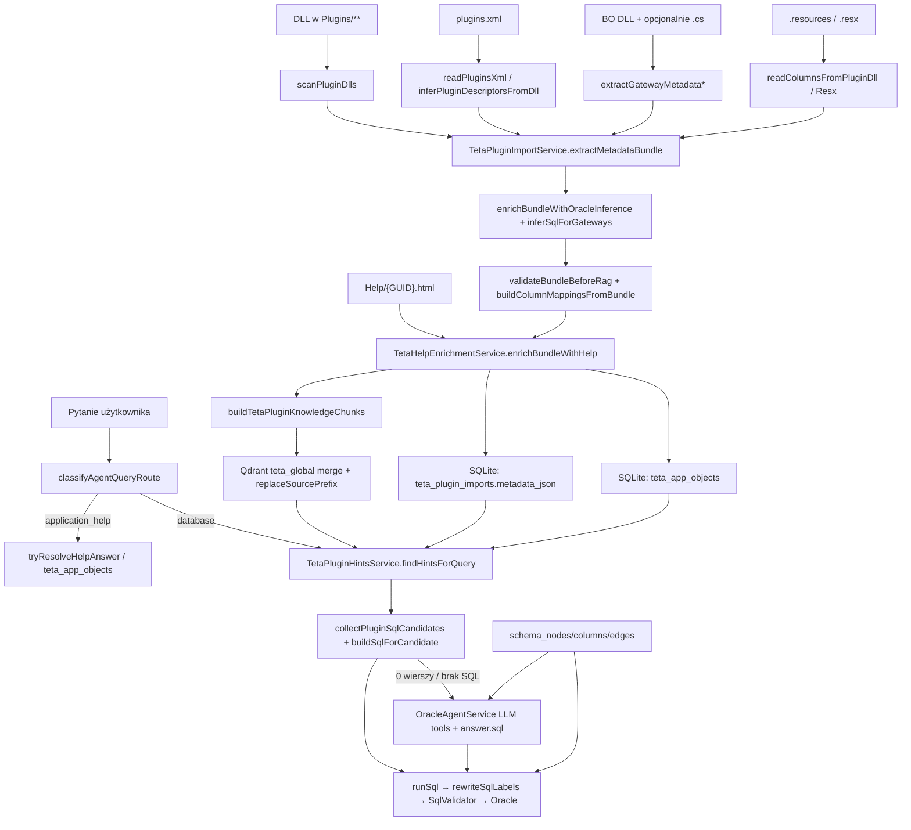

# AIA — audyt mapowania obiektów aplikacji Teta ↔ Oracle

**Data:** 2026-07-21  
**Zakres:** TetaAIAssistant (`apps/api`, `packages/shared`, lokalna baza `apps/api/data/teta.sqlite`)  
**Cel:** ustalić, dlaczego asystent nie potrafi jednoznacznie powiązać obiektów UI z obiektami Oracle.  
**Metoda:** tylko stan faktyczny z kodu i rekordów w SQLite. Brak implementacji zmian.  
**UNKNOWN** = nie potwierdzono w kodzie ani w danych.

Stan lokalnej bazy (odczyt 2026-07-21):

| Tabela | Liczba |
|--------|--------|
| `teta_plugin_imports` | 107 |
| `teta_app_objects` | 2315 |
| `schema_nodes` | 9769 |
| `schema_columns` | 100907 |
| `teta_app_objects.confidence='confirmed'` + `help_field_text` | **0** |
| `teta_app_objects.form_guid IS NOT NULL` | **0** |
| `teta_app_objects` z niepustym `help_field_text` | **0** |

---

## 1. Diagram aktualnego przepływu



---

## 2. Istotne pliki i komponenty

| Warstwa | Plik | Rola |
|---------|------|------|
| HTTP import | `apps/api/src/teta-plugins/vendor-teta-plugins.controller.ts` | status / import / bulk |
| Import | `teta-plugin-import.service.ts` | orchestracja ekstrakcji → RAG → SQLite |
| Skan DLL | `teta-plugin-scan.util.ts` | `scanPluginDlls` |
| Bundle types | `teta-plugin-metadata.types.ts` | `TetaPluginMetadataBundle` |
| Gateway SQL parse | `teta-plugin-gateway-sql.util.ts` | `stripTetaBuilderMarkers` (usuwa `<SqlJoin>`) |
| Binding UI↔Oracle | `teta-plugin-grid-column-mapper.ts` | `buildGridOracleColumnLinks` (heurystyka) |
| Mapowania | `teta-plugin-column-mapping.ts` | `buildColumnMappingsFromBundle`, `resolveOutputMappingsFromQuery` |
| Help | `teta-help-html.parser.ts`, `teta-help-enrichment.service.ts` | HTML → `applicationObjects` |
| App objects | `teta-application-object.types.ts`, `teta-application-object.builder.ts` | model łańcucha help+binding |
| Chunki RAG | `teta-plugin-chunk.builder.ts` | overview / gateway / fields / help / columns |
| Registry | `teta-plugin-registry.service.ts`, `teta-app-object-registry.service.ts` | upsert SQLite |
| Qdrant import | `apps/api/src/rag/global-rag-chunks-import.service.ts` | merge + delete prefix |
| Retrieval | `apps/api/src/rag/rag-retrieval.service.ts` | embed + search + rerank + dedup |
| Hints Oracle | `teta-plugin-hints.service.ts` | RAG → bundle → prompt / SQL |
| Fast SQL | `teta-plugin-column-resolver.ts`, `teta-plugin-candidate-probe.ts` | SELECT deterministyczny |
| Agent | `apps/api/src/schema/oracle-agent.service.ts` | routing + probe + LLM |
| Walidacja | `apps/api/src/schema/sql-validator.service.ts` | SELECT-only, tabele, kolumny (ograniczenie) |
| Graf Oracle | `apps/api/src/schema/schema-graph.service.ts` | nodes/columns/FK/heurystyki |
| Schema DB | `apps/api/src/database/database.service.ts` | DDL SQLite |
| Router | `apps/api/src/agent/agent-query-router.ts` | `application_help` vs `database` |

**TCHelper w runtime importu:** klasa `TchelperRunnerService` istnieje, ale **nie jest wywoływana** z Nest import path — **UNKNOWN** jako aktywne źródło w bieżącym flow.

---

## 3. Obiekty aplikacyjne — wydobycie / transformacja / zapis / utrata

| Element | Wydobycie | Transformacja | Zapis | Utrata / UNKNOWN |
|---------|-----------|---------------|-------|------------------|
| Nazwa DLL | `scanPluginDlls`, `bundle.dllName` | — | `teta_plugin_imports.dll_name` | wykluczenia ścieżek `en`/`hu` |
| Nazwa formularza | `plugins.xml` Languages PL / infer | `formDisplayName` | JSON form + chunk `form_names` | bez XML: nazwa z ClassName / infer |
| Identyfikator formularza (GUID) | `readPluginsXml` → `Plugin.Guid` | ścieżka Help `{guid}.html` | `form.Plugin.Guid`, `teta_app_objects.form_guid` | **w lokalnej bazie: 0 rekordów z GUID**; infer bez XML nie ustawia Guid |
| Sekcja formularza | tylko HTML help `h2`/`h3` | `help_section` | `teta_app_objects.help_section` | **UNKNOWN** jako sekcja WinForms; lokalnie help_section często null |
| Kontrolka | grid `*.DisplayedName` / resx → `GridColumnName` (`dgc*`) | mapowanie | `columnMappings.gridColumnName` | kontrolki poza gridem: **UNKNOWN** |
| Identyfikator kontrolki (designer) | — | — | — | **UNKNOWN** — brak w kodzie |
| Etykieta UI | Labels/Hints PL | `pickDisplayLabel` | mapping.label, app_objects.field_label | EN/HU pomijane |
| Binding | `buildGridOracleColumnLinks` heurystyka nazw + komentarze schematu | `TetaPluginColumnMapping` | metadata_json + binding_json | fałszywe dopasowania (patrz §5) |
| Datasource | brak typu; używane ViewName / BaseTableName / DatasetTableName | gateway meta | gateway w JSON | wiele gatewayy z `ViewName=null` (dump) |
| Nazwa gatewaya | `*MTG`/`*TG` z BO/source/DLL | `ClassName` | gateway + chunk path | pominięcie przy nietypowych nazwach |
| SQL formularza | `inferSqlForGateways`, `LabeledSelect` | snapshot `Gateways[].Sql` | JSON; w chunku głównie LabeledSelect | `formatSqlBlock` (FlatQuery/Direct) **nie** jest używany w `buildGatewayChunk` |
| SqlJoin | obecny w builder SQL Teta | `stripTetaBuilderMarkers` **usuwa** `<SqlJoin>…</SqlJoin>` | — | **celowo tracony** (`teta-plugin-gateway-sql.util.ts`) |
| Widok / tabela / pakiet | tagi BO (`Perspektywa`, `TabelaBD`, `PakietDAC`) + walidacja ALL_OBJECTS | RelatedPackages DAC/AGL/LEP | gateway + oracleDiscovery | obiekty nieistniejące w Oracle usuwane przy validate |
| Help kontekstowy | `{client}/Help/{GUID}.html` | `parseTetaHelpHtml` → fields | `form.Help`, app_objects | **wymaga GUID**; lokalnie `help_field_text` = **0** rekordów |

---

## 4. Jednoznaczność mapowania — łańcuch

**Oczekiwany łańcuch:**  
DLL → formularz → sekcja → kontrolka → etykieta → binding → alias SQL → datasource → tabela/widok → kolumna → pakiet.

**Stan faktyczny:**

| Pytanie | Odpowiedź (dowód) |
|---------|-------------------|
| Czy cały łańcuch w jednym rekordzie? | **Nie.** Per-DLL blob `metadata_json` + wiele `teta_app_objects` + wiele chunków Qdrant. |
| Czy elementy w wielu rekordach? | **Tak.** |
| Wspólny stabilny ID? | Częściowo: `dll_path`. Form: GUID **gdy** XML. Field: syntetyczny `object_id` = `dllStem:form:field` (zmiana etykiety = nowy ID). Kontrolka: tylko `dgc*`. |
| Powiązania deterministyczne? | Gateway View/Package z BO — względnie. **Binding etykieta→kolumna: heurystyczny** (`buildGridOracleColumnLinks`). JOIN: hardcoded IPRA_ID/PRAC_ID lub LLM `find_path`, nie SqlJoin. |
| Część tylko przez LLM? | Tak — fallback w `oracle-agent.service.ts` gdy probe nie da wierszy; help bez `help_field_text` → LLM. |

**Braki w łańcuchu (potwierdzone):** sekcja UI, control id, SqlJoin, pewność bindingu (wszystkie app_objects lokalnie = `inferred`).

---

## 5. Model danych wiedzy (rzeczywisty)

### 5.1 Magazyny

| Magazyn | Zawartość |
|---------|-----------|
| SQLite `teta.sqlite` | pluginy, app objects, graf schematu, audit, chat |
| Qdrant `teta_global` | chunki `source_type=teta_plugin` (+ inne globalne) |
| Qdrant `teta_client` | dokumenty klienta (poza zakresem pluginów) |
| `metadata_json` w SQLite | pełny `TetaPluginMetadataBundle` |
| `apps/api/config/teta-computed-intents.json` | formuły (np. wiek) — nie mapowanie UI |
| `apps/api/config/teta-query-language.json` | przyimki / tokeny filtra |
| Cache | experience_paths w SQLite; **UNKNOWN** osobny cache mapowań |

### 5.2 Schemat SQLite (z `database.service.ts`)

**`teta_plugin_imports`:**  
`dll_path` PK, `dll_name`, `relative_path`, `category_dir`, `imported_at`, `chunk_count`, `updated_at`, `metadata_json`.

**`teta_app_objects`:**  
`object_id` PK, `dll_path`, `dll_name`, `form_guid`, `form_name`, `field_label`, `help_title`, `help_summary`, `help_field_text`, `help_section`, `binding_json`, `keywords_json`, `confidence` (`confirmed`\|`inferred`), `updated_at`.

**Graf:** `schema_nodes`, `schema_columns` (**tylko tabele** — widoki bez kolumn), `schema_edges` (FK + heurystyki), `schema_sources`, `experience_paths`.

### 5.3 Przykłady z lokalnej bazy (nie hipotetyczne)

**Import DLL (fragment):**

```json
{
  "dll_name": "plgSkladnikiPlac.dll",
  "relative_path": "Personnel/plgSkladnikiPlac.dll",
  "chunk_count": 445,
  "forms": 1,
  "columnMappings": 472,
  "applicationObjects": 73,
  "form_guid": null,
  "form_name": "ArkuszSkladnikow",
  "gateways_sample": [
    { "ClassName": "EmployeeInsuranceTG", "ViewName": null, "PackageName": null },
    { "ClassName": "PracownicyMTG", "ViewName": "NT_KP_PRC_PRACOWNICY", "TableAlias": "PRAC", "hasLabeledSelect": true }
  ]
}
```

**Mapowanie z `metadata_json.columnMappings[0]` — błędny binding:**

```json
{
  "oracleColumnName": "ID",
  "label": "Kwota wypłacona",
  "gridColumnName": "dgcAmountPaid",
  "synonyms": ["Kwota wypłacona", "Wartość składnika okresowego  kwota  wypłacona", "dgcAmountPaid"],
  "pluginColumnName": "ID",
  "resolvedColumnName": null,
  "targetObject": "NT_KP_PRC_PRACOWNICY",
  "dllName": "plgSkladnikiPlac.dll",
  "formName": "ArkuszSkladnikow",
  "gatewayClassName": "KartotekaWynagrodzenTempMTG"
}
```

**`teta_app_objects` (rzeczywiste wiersze):**

```json
{
  "object_id": "plgSkladnikiPlac:arkuszskladnikow:imie",
  "form_guid": null,
  "form_name": "ArkuszSkladnikow",
  "field_label": "Imię",
  "confidence": "inferred",
  "help_field_text": null,
  "binding_json": {
    "gridColumnName": "dgcImie",
    "oracleColumnName": "IMIE",
    "targetObject": "NT_KP_PRC_PRACOWNICY",
    "gatewayClassName": "KartotekaWynagrodzenTempMTG"
  }
}
```

**Sprzeczne mapowania „Nr ewidencyjny” (ten sam grid, różne kolumny Oracle):**

| dll | grid | oracle_col | target |
|-----|------|------------|--------|
| plgAbsencje.dll | dgcAbsencjaNrEwidencyjny | **ID** | NT_KP_PRC_PRACOWNICY |
| plgAbsencje.dll | dgcAbsencjaNrEwidencyjny | **NR_EWIDENCYJNY** | NT_KP_PRC_PRACOWNICY |

**„Imię” → wiele kolumn:** `IMIE`, `IMIE_DRUGIE`, `IMIE_OJCA`, `IMIE_MATKI`, `IMIE_MALZONKA` (ten sam `dgcAbsencjaImie`).

**Schemat Oracle w grafie:**

| Obiekt | node_type | kolumny w `schema_columns` |
|--------|-----------|----------------------------|
| `T_PRAC` | table | 339 (m.in. `IMIE`, `NAZWISKO`, `NR_EW`) |
| `NT_KP_PRC_PRACOWNICY` | view | **0** |
| `NT_KP_IMP_SZKOLY` | view | **0** |

### 5.4 Chunk Qdrant (struktura z `teta-plugin-chunk.builder.ts` + `packages/shared`)

Przykład zgodny z kodem `buildFieldMappingChunks` (tekst embedowany = `summary?\n\n`+`text`, max `OLLAMA_EMBEDDING_MAX_CHARS` domyślnie 2048):

```json
{
  "id": "<randomUUID>",
  "source": "teta-plugins/Personnel/plgPracownik/forms/<formKey>/fields/dgcImie",
  "source_type": "teta_plugin",
  "text": "Pole UI w Teta — formularz **…**. Etykieta: „Imię”. Kontrolka grida: dgcImie. Gateway: …. Widok/tabela Oracle: …. Kolumna Oracle (binding): IMIE.",
  "summary": "…",
  "plugin_names": ["plgPracownik"],
  "form_names": ["…"],
  "tables": ["…"],
  "keywords": ["…"],
  "knowledge_version": "teta-knowledge-chunk-v1"
}
```

**Jeden obiekt aplikacyjny ≠ jeden chunk:** overview + help + gateway(y) + batch columns + field mapping (do 400).  
**Payload nie niesie:** `object_id`, `confidence`, pełnego `binding_json`, SqlJoin, control designer id.

---

## 6. Import do Qdrant

| Temat | Fakt |
|-------|------|
| Co trafia | Chunki z `buildTetaPluginKnowledgeChunks` |
| Chunkowanie | Wiele rodzajów per form (patrz wyżej) |
| Metadane zachowane | `source`, `source_type`, `plugin_names`, czasem `form_names`/`tables`/`keywords` |
| Metadane tracone | SqlJoin; pełne Direct/Builder SQL (nie w gateway chunk); confidence; object_id |
| Powiązanie tabela↔kontrolka | Tylko w tekście chunka / path `…/fields/{grid}`; brak join key w payload |
| Embedding | Z tekstu (`buildKnowledgeEmbeddingText`), nie ze strukturalnego rekordu |
| Aktualizacja | `merge` + `replaceSourcePrefix: teta-plugins/{relativePath}/`; point id = `randomUUID()` → zależność od delete prefix; ryzyko starych chunków przy zmianie formKey/GUID (**kod:** fallback delete po exact sources) |

Konfiguracja (defaults): `QDRANT_COLLECTION_GLOBAL=teta_global`, `RAG_PLUGIN_TOP_K=8`, `RAG_PLUGIN_SEARCH_LIMIT=24`, `RAG_CHAT_MIN_SCORE=0.55`.

---

## 7. Retrieval i RAG

| Krok | Implementacja |
|------|----------------|
| Query → wektor | Embed pytania; rewrite tylko `stripPersonNameLiteralsForPluginSearch` (hints) |
| Kolekcje | Oracle hints: global `teta_global`; chat docs: global±client |
| Filtry metadata | `source_type=teta_plugin` (+ opcjonalnie module/topic/plugin_names z UI). **Brak** filtra `form_name` / kontrolki w Qdrant |
| top_k / searchLimit | plugin: 8 / 24; chat: `RAG_CHAT_TOP_K=2`, `SEARCH_LIMIT=16` |
| Score threshold | `minScore` 0.55 (chat; hints dziedziczą) |
| Rerank | Heurystyka keyword (`rag-query-rerank.util.ts`), nie cross-encoder; boost „Pole UI w Teta” +0.26 |
| Dedup | `{collection}:{source}:{chunkIndex}` |
| Łączenie chunków jednego formularza | **Nie** jako grupowanie; post-hoc path parse + ranking lokalny `teta_app_objects` |

**Czy najpierw formularz → kontrolka → binding?**  
**Nie.** Globalny semantic search, potem doładowanie pełnego `metadata_json` z SQLite i lokalne dopasowanie etykiet.

Kontekst do modelu (Oracle): nie surowy chunk, lecz `formatPluginOracleHintsForPrompt` (max 5 gateway, 12 kolumn) + max 4 app objects help + computed intents (`TetaPluginHintsService`).

---

## 8. Generowanie SQL

| Temat | Fakt |
|-------|------|
| Plan zapytania | Fast path: role filter/output (`splitQueryIntentSections`) → mappings → candidate objects → `buildDirectEmployeeSelect` / KDR special. **Brak** osobnego AST planu JOIN/FK. |
| LLM SQL | Bezpośrednio `answer.sql` w pętli narzędzi |
| Lista tabel/kolumn | Z plugin mappings + gateways; LLM: `search_tables` / `describe_table` na grafie |
| Relacje | FK w `schema_edges`; heurystyki L_/SL_/_ID; hardcoded `IPRA_ID`/`PRAC_ID`; KDR→SLO join; **SqlJoin nieużywany**; LLM `find_path` |
| Wybór bez mapowania | **Tak** — LLM może wybrać tabelę/kolumnę; validator nie wymaga „confirmed mapping” |
| SELECT vs WHERE vs JOIN | Fast path rozdziela output/filter; JOIN nie z SqlJoin |

---

## 9. Walidacja (przed execute)

| Kontrola | Jest? | Deterministyczna? |
|----------|-------|-------------------|
| Tylko SELECT | Tak | Tak (`SqlValidatorService`) |
| Zakaz DML/DDL | Tak | Tak |
| Limit wierszy | Tak (`FETCH FIRST`) | Tak |
| Tabela/widok istnieje w grafie | Tak | Tak |
| Kolumna należy do obiektu | Częściowo | Tak **tylko gdy** `schema_columns` ma kolumny; **widoki mają 0 kolumn → sprawdzenie pomijane** (`findUnknownSelectColumns`) |
| Alias → właściwa tabela | Nie osobno | — |
| JOIN z FK/SqlJoin | **Nie** | — |
| Filtr = pojęcie użytkownika | Fast path heurystyka; LLM soft | Częściowo |
| Brak niepotwierdzonych obiektów | **Nie** | — |
| LLM review SQL | Nie | — |

Rewrite etykiet: `rewriteSqlLabelsUsingPluginMappings` — deterministyczny, ale może retargetować FROM; pomija SQL z JOIN/aliasami.

---

## 10. Trzy przypadki referencyjne

### A. „Jakie jest imię i nazwisko pracownika o numerze ewidencyjnym 00122?”

**Oczekiwane (spec audytu):** `T_PRAC.IMIE/NAZWISKO/NR_EW`.  
**Kod faktycznie preferuje:** widoki pluginów (`NT_KP_PRC_PRACOWNICY`), kolumna filtra `NR_EWIDENCYJNY` / `NR_EWD` z mappings (niekoniecznie `T_PRAC.NR_EW`).

**Dlaczego może wygrać NAZWISKO zamiast NR_EW / NR_EWIDENCYJNY:**

1. W SQLite **równolegle** istnieją mapowania `Nr ewidencyjny` → `ID` **i** → `NR_EWIDENCYJNY` (ten sam grid).
2. Etykieta „Imię” mapuje też `IMIE_*` (ojca, matki, …) — szum OUTPUT.
3. Przy słabym dopasowaniu filtra (`resolveFilterMappingFromQuery` score) lub ścieżce LLM wartość `00122` może trafić na złą kolumnę.
4. Fast path ze dobrymi mappings **jest zaprojektowany** na rozdział output/filter (`teta-plugin-column-mapping.spec.ts`) — ale jakość zależy od sprzecznych rekordów w wiedzy.
5. Walidacja kolumn na widoku `NT_KP_PRC_PRACOWNICY` jest **pusta** (0 kolumn w grafie).

### B. „Do czego służy pole Staż na formularzu Wykształcenie?”

**Routing:** `application_help` (`isFieldHelpQuestion`).

**Łańcuch bez zgadywania wymaga:** `teta_app_objects` z `form_name`≈Wykształcenie, `field_label`≈Staż, niepustym `help_field_text`, bindingiem do właściwej kolumny (np. `LATA_STAZU` / `NT_KP_IMP_SZKOLY`).

**Lokalna baza:**

- `help_field_text` niepusty: **0**
- `confidence='confirmed'`: **0**
- `form_guid`: **0**
- Znalezione „staż”: inne formularze (ArkuszeOcen, AsortymentSrodkowBHP), `LATA_STAZU` na `NT_KP_SLO_STOPIEN_WYKSZT` / formularz BHP — **nie** Wykształcenie.

**Wniosek:** obecny system **nie przechodzi** pełnego łańcucha help bez zgadywania na tej instalacji — spada do LLM z cienkim kontekstem RAG. Przyczyna główna: brak GUID → brak Help HTML → brak `help_field_text` (kategoria A + B).

### C. „Jakie stanowisko ma pracownik 00122 na wskazany dzień?”

| Oczekiwanie | Fakt |
|-------------|------|
| Lookup ID→nazwa | Częściowo: KDR + JOIN `NT_KP_SLO_STANOWISKA` (`buildSqlForCandidate`) |
| `AKT_DATE_STANOWISKO` / `OST_DANE_STANOWISKO` | **Brak** w repo (grep = 0) |
| Ścieżka historyczna | Lista `DATA_OD`/`DATA_DO` przy „stanowiska”; „aktualne” filtruje vs **`SYSDATE`**, nie vs data z pytania |
| „wskazany dzień” | **Nieparsowane** |
| Fakty z DLL/SqlJoin | SqlJoin usunięty; funkcje biznesowe tylko przez `get_package_source` LLM |

---

## 11. Klasyfikacja problemów (A–J)

| ID | Problem | Kategoria | Wpływ |
|----|---------|-----------|-------|
| P1 | Binding etykieta→kolumna heurystyczny; sprzeczne rekordy (`Nr ewidencyjny`→ID vs NR_EWIDENCYJNY; Imię→IMIE_*) | **H**, **I**, **C** | Krytyczne |
| P2 | `<SqlJoin>` usuwany — brak faktów JOIN z Teta | **B**, **H** | Krytyczne |
| P3 | Widoki w grafie bez kolumn → walidacja SELECT kolumn nieskuteczna | **G** | Krytyczne |
| P4 | Help: 0× GUID / 0× help_field_text lokalnie → łańcuch help martwy | **A**, **B** | Krytyczne |
| P5 | Retrieval globalny semantic, bez zawężenia form→control | **D** | Wysokie |
| P6 | Łańcuch rozproszony (JSON + app_objects + wiele chunków UUID), brak stabilnego field ID | **C** | Wysokie |
| P7 | LLM może wybrać tabelę/kolumnę bez confirmed mapping | **E**, **F**, **G** | Wysokie |
| P8 | Gateway chunk bez pełnego SQL / SqlJoin; embedding tylko tekst | **B**, **D** | Średnie |
| P9 | Stale chunki przy UUID + niepełnym delete | **I** | Średnie |
| P10 | Brak as-of date / funkcji AKT_* dla stanowiska | **A**, **F** | Średnie |
| P11 | Control id / sekcja UI nieekstrahowane | **A** | Średnie |
| P12 | Hardcoded kandydaci stanowisk (whitelist) łata objawy, nie model | **J** | Niskie (mitigacja) |
| P13 | Oczekiwane `T_PRAC` vs faktyczne widoki `NT_KP_*` z pluginów | **I**, **J** | Średnie (rozjazd modelu domenowego) |

---

## 12. Lista problemów według wpływu

### Krytyczne

1. Heurystyczne i sprzeczne mapowania kolumn w wiedzy (P1) — asystent „uczy się” fałszywych faktów.  
2. Utrata SqlJoin (P2) — relacje nie pochodzą z aplikacji.  
3. Widoki bez kolumn w grafie (P3) — walidacja nie chroni przed złą kolumną.  
4. Brak help GUID/tekstu (P4) — pytania o znaczenie pól nie mają bazy faktów.

### Wysokie

5. Retrieval nie zawęża formularza/kontrolki (P5).  
6. Porozrywany model łańcucha (P6).  
7. SQL LLM bez wymogu potwierdzonego mapowania (P7).

### Średnie

8–11, 13 — chunk SQL, stale points, as-of, brak control id, rozjazd T_PRAC vs NT_*.

### Niskie

12 — whitelisty jako obejścia.

---

## 13. Jednoznaczna odpowiedź: gdzie leży problem głównie?

**Głównie w modelu danych + ekstrakcji/bindingu (nie „w samym Qdrancie”).**

Kolejność wag:

1. **Ekstrakcja / binding** — heurystyka `buildGridOracleColumnLinks`, sprzeczne mappings, brak SqlJoin, brak GUID/help.  
2. **Model danych** — brak jednego rekordu łańcucha ze stabilnym ID i `confidence` faktycznie `confirmed`.  
3. **Walidacja** — nieskuteczna dla widoków (0 kolumn).  
4. **Retrieval** — wzmacnia szum (global semantic), ale nie jest pierwotną przyczyną fałszywych faktów.  
5. **Agent / prompt / generator SQL** — eksploatują złą wiedzę; LLM jest ścieżką awaryjną bez twardej bramki.

Qdrant jest **nośnikiem** już zanieczyszczonej / porozrywanej wiedzy, nie głównym źródłem pomyłek tabel.

---

## 14. Maksymalnie pięć pierwszych zmian (propozycja, bez implementacji)

1. **Deduplikacja i scorowanie bindings:** jeden zwycięski `(dll, form, gridColumn) → (targetObject, oracleColumn)` z jawnym `confidence`; odrzut `Nr ewidencyjny→ID` gdy istnieje `NR_EWIDENCYJNY`/`NR_EW`.  
2. **Zachować i indeksować SqlJoin** (oraz używać w fast path / `find_path`) zamiast strip.  
3. **Kolumny widoków w `schema_columns`** (lub walidacja względem ALL_TAB_COLUMNS) — twarda kontrola SELECT.  
4. **Wymusić GUID z plugins.xml przed help/RAG** i nie oznaczać app_objects jako użytecznych do help bez `help_field_text`.  
5. **Retrieval dwuetapowy:** filtr/metadata `form_names` (lub path prefix) → potem pola; nie global-only dla pytań z nazwą formularza.

---

## 15. UNKNOWN (świadomie)

- Czy w innych instalacjach `form_guid` / help jest wypełniony (tu: nie).  
- Czy Qdrant MatchText na `source` działa bez indeksu payload w danej wersji Qdrant.  
- Pełna lista designer control id w DLL (nieparsowana).  
- Czy funkcje `AKT_DATE_STANOWISKO` istnieją w PL/SQL klienta (nie ma w repo aplikacji; graf `schema_sources` — nie audytowano pełnego dumpa pod tą nazwą w tej sesji).  
- Dokładny stan kolekcji Qdrant point-by-point (nie dumpowano wektorów; wnioski z kodu importu + SQLite chunk_count).

---

*Koniec audytu. Plik: `docs/AIA_APPLICATION_DB_MAPPING_AUDIT.md`.*
